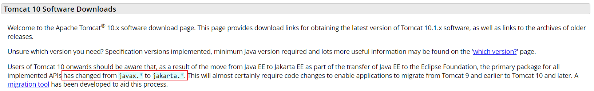
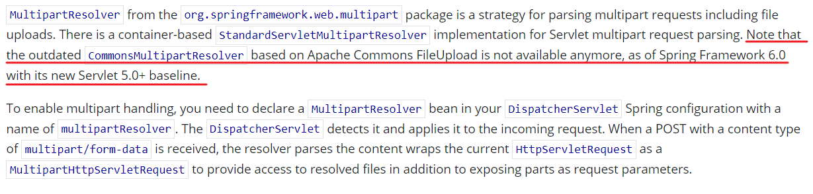

# fileshare
## 为什么做该项目
在学校实验室做实验时，老师会在课上发一些文件(实验材料等一些压缩包)，但是这些压缩包在手机上打开需要一些特定的支持(比如必须下载某Q浏览器)，实验室的电脑又没有QQ、微信，所以想在电脑上打开文件感觉很鸡肋，于是该项目应运而生(虽然网上也有类似的，但还是自己写的香)。

## 项目描述
该项目只提供了三个接口，因为是个人平常用，所以没有提供登录注册的功能。用户通过前端页面上传文件，并填写相关的信息，然后选择上传的文件，文件上传成功后，系统将文件的下载链接发送到填写的邮箱，用户通过分享邮件里的链接分享文件（你只需要在浏览器里打开即可）

前端界面和代码写的很糙:(
## 项目功能
- [x] 文件上传
- [x] 文件下载
- [x] 发送邮件
- [x] 接口限流

## 项目使用的技术栈
- Spring
- SpringMVC
- Spring Data JDBC
- Guava(使用了它的限流器和本地缓存)
- MySQL(因为文件不大，我直接将文件按照字节数组存到数据库里)
- Thymeleaf(事实上也没咋用)
- axios
- vue3
## TODO

- [ ] 项目中的异常处理不是很优雅，虽然丑，但也完成了基本的功能，后面学习后会优化项目中异常处理的代码结构
- [ ] 给前端界面添加友好提示(看心情吧)

## 项目中遇到的问题

虽然项目很小，但也算比较完整，能够提供基本的功能，项目中也遇到了一些问题

1. tomcat和Spring版本问题
    
    这个问题主要是因为Spring6和Tomcat不同版本需要的servlet-api不一样
    
2. SpringMVC6文件上传的问题
    
    对于spring6中怎么写，看官网：https://docs.spring.io/spring-framework/reference/web/webmvc/mvc-servlet/multipart.html

## 运行项目
### 环境要求
- JDK17
- Tomcat10.x
- Spring6.x
- MySQL8.0

1. 拉取代码
    > git clone git@github.com:eric49861/fileshare.git
2. 安装maven中的pom依赖
3. 修改配置文件
    - 数据库配置
    - 邮件服务器配置(我加到了环境变量里)
4. 运行项目